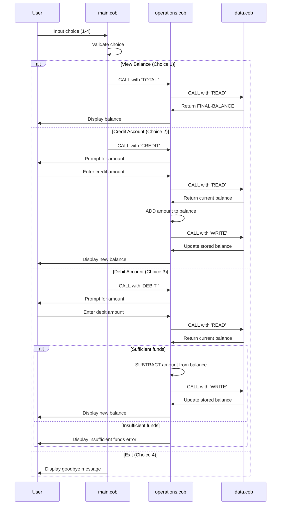

# COBOL Student Account Management (week4-lab004)

This documentation provides a high-level overview of the COBOL source files in this repository, with purpose, key functions, and business rules for student account operations.

## Repository structure

- `src/cobol/main.cob` - Main entry point and user interaction loop.
- `src/cobol/operations.cob` - Business logic for viewing balance, crediting, and debiting.
- `src/cobol/data.cob` - In-memory storage manager for current balance (simulated data store).

---

## File details

### `src/cobol/main.cob`

Purpose:
- Implements the interactive menu for the Account Management System.
- Reads user choice and delegates to `Operations` program.

Key logic:
- Menu options:
  - 1: View Balance (`CALL 'Operations' USING 'TOTAL '`)
  - 2: Credit Account (`CALL 'Operations' USING 'CREDIT'`)
  - 3: Debit Account (`CALL 'Operations' USING 'DEBIT '`)
  - 4: Exit loop and stop program
- Input validation: `WHEN OTHER` displays error for invalid choice.

Business rules:
- Loop continues until user selects Exit.

---

### `src/cobol/operations.cob`

Purpose:
- Handles account operations: total balance, crediting, and debiting.
- Coordinates with `DataProgram` to read/write the balance.

Key logic:
- `OPERATION-TYPE` is set from the call parameter (`TOTAL `, `CREDIT`, or `DEBIT `).
- `TOTAL`:
  - Calls `DataProgram` with `READ` to load `FINAL-BALANCE`.
  - Displays current balance.
- `CREDIT`:
  - Prompts for amount, reads current balance, adds amount, writes back, and displays updated balance.
- `DEBIT`:
  - Prompts for amount, reads current balance, checks if sufficient funds, subtracts amount, writes back, and displays updated balance.
  - If insufficient funds, displays a warning and keeps balance unchanged.

Business rules:
- Debit operation requires `FINAL-BALANCE >= amount`.
- If insufficient, operation is refused and user is notified.
- Data read/write occurs through `DataProgram` for all operations.

---

### `src/cobol/data.cob`

Purpose:
- Acts as the data persistence layer using an in-memory variable `STORAGE-BALANCE` (initial value 1000.00).
- Provides a simple `READ` and `WRITE` interface to other programs.

Key logic:
- `READ`: moves `STORAGE-BALANCE` into output `BALANCE`.
- `WRITE`: updates `STORAGE-BALANCE` from input `BALANCE`.

Business rules:
- Initial student account balance starts at `1000.00`.
- All operations use `DataProgram` to ensure the current balance is shared across calls.

---

## Student account behavior summary

- Starting balance is `1000.00`.
- View balance shows the current value maintained by `DataProgram`.
- Credit increases balance by user-entered amount.
- Debit reduces balance only when funds are sufficient.
- Invalid menu selections are rejected with an error message.

---

## Data Flow Diagram

The following sequence diagram illustrates the interaction between the three COBOL programs and the user for each account operation:

### Data flow summary

1. **User initiates request** → MainProgram displays menu and captures user choice
2. **Operation delegation** → MainProgram calls Operations program with operation type
3. **Balance retrieval** → Operations calls DataProgram with 'READ' to fetch current balance
4. **Processing** → Operations performs calculation (add/subtract) or just displays value
5. **Balance update** → For credit/debit, Operations calls DataProgram with 'WRITE' to persist new balance
6. **User feedback** → Operations displays result (new balance, error, etc.) back to user
